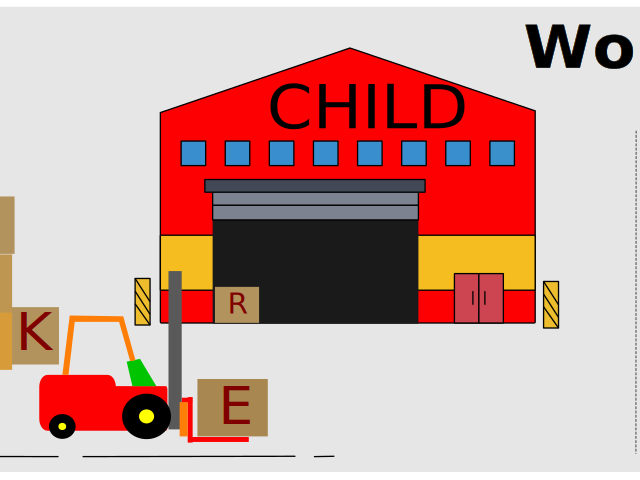
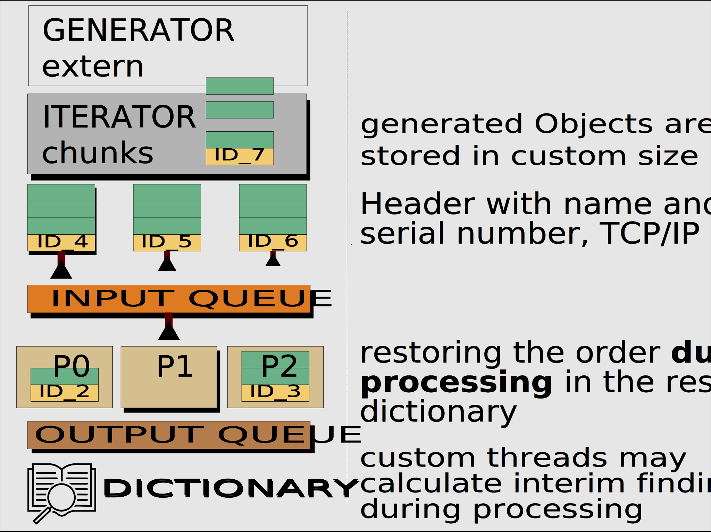
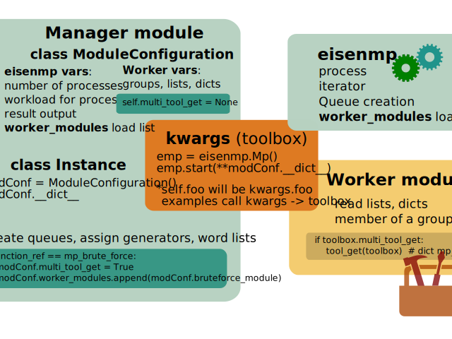

Introduction
############

.. image:: https://github.com/44xtc44/eisenmp/actions/workflows/tests.yml/badge.svg
   :target: https://github.com/44xtc44/eisenmp/actions/workflows/tests.yml

Python 3.7

`Multiprocessor <https://en.wikipedia.org/wiki/Multiprocessing>`_
`Framework <https://en.wikipedia.org/wiki/Software_framework>`_ for single Server

Kwargs To Go

Features:

* **Uniform** foundation to create multiprocess project modules
* **Workload Chunks** with header to control output and speed up a specific task
* Chunks get a serial number (ID), findings can be checked in a result dictionary, which ID is missing
* **module_loader** decouples your Worker imports from Main()
* **Categories of Queues**, assign Names to Queues and groups of Queues
* **Queue list** helps to debug your setup and reveals the name, object id and object reference of every Queue
* **Print Queue** allows formatted print to screen for your processes (blocks)
* No libraries, (Linux, Windows)

| Visit the features above in the `Examples gitHub repository <https://github.com/44xtc44/eisenmp_examples>`_
| or

download the all inclusive `PyPi Examples package <https://pypi.org/project/eisenmp-examples/>`_ and
execute **eisenmp_url** in Terminal to start the simpleHTTP Ajax server

| All scenarios run on **Template Style Modules**. Enjoy the descriptions.

How it works
~~~~~~~~~~~~
You write two functions and two modules.
Let's name them **Manager.py** and **Worker.py**.

1. Manager.py defines custom objects and starts a new process, target is **module_loader.py** (loader)
2. loader imports your (independent) Worker.py module from file system without side effects
3. loader sits in a loop and calls your Worker.py entry function until queue is empty
4. **q_feeder** iterator sends a STOP message. Your Worker reads STOP, return False and exit.
5. **module_loader** module then puts a STOP Worker message in all other input queues.
6. **Next** Worker reads STOP, exit ...
7. Loader runs idle and awaits the internal STOP Process message.

Generators
~~~~~~~~~~~

Variables transfer to worker
~~~~~~~~~~~~~~~~~~~~~~~~~~~~~
The worker should be more flexible. Thus, it needs more structured information.

* Information collector is the ``ModuleConfiguration`` class instance. The class can carry any name.
* All instance attributes are stored in a dictionary __dict__. (self.foo will be kwargs.foo)
* The instance dictionary is argument (`kwargs`) to call the eisenmp start method.
* `Kwargs` is updated further with queue information and the START_SEQUENCE_NUM of the process, before process start.

Default Queues

- ``Input`` worker lists, ``Output`` result and stop lists
- ``Tools``, ``Print``, ``Info``

How to run the examples?
~~~~~~~~~~~~~~~~~~~~~~~~~
Fast `PyPi package <https://pypi.org/project/eisenmp-examples/>`_. **eisenmp** will be installed also.

In depth. Clone both repos.

`eisenmp <https://github.com/44xtc44/eisenmp>`_ and
`eisenmp_examples <https://github.com/44xtc44/eisenmp_examples>`_

Install in editable pip mode.

::

    cd eisenmp
    pip3 install -e .  # uninstall (linux pip3) with: pip3 uninstall eisenmp

    cd eisenmp_examples
    pip3 install -e .  # uninstall with: pip3 uninstall eisenmp_examples

Run the examples. Either local Ajax Web server or terminal menu.

::

    eisenmp_url
    # or
    eisenmp_menu

Get the documentation on readthedocs https://eisenmp.readthedocs.io/

