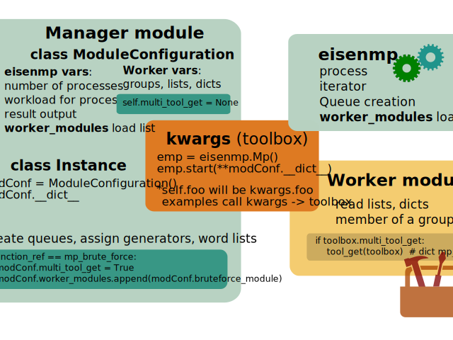

Details
=======

Structure
~~~~~~~~~~
| Designed with regard to a clear separation between manager and worker module.

Worker

* does only the specific task

Manager

* configures the amount of result output
* assign groups, lists, queues
* configures the performance with CPU count and workload

Variables transfer to worker
~~~~~~~~~~~~~~~~~~~~~~~~~~~~~
The worker should be more flexible. Thus, it needs more structured information.

* Information collector is the ``ModuleConfiguration`` class instance. The class can carry any name.
* All instance attributes are stored in a dictionary __dict__. (self.foo will be kwargs.foo)
* The instance dictionary is argument (`kwargs`) to call the eisenmp start method.
* `Kwargs` is updated further with queue information and the START_SEQUENCE_NUM of the process, before process start.

Generator - iterator chunks on every CPU core
~~~~~~~~~~~~~~~~~~~~~~~~~~~~~~~~~~~~~~~~~~~~~~
`Generator yield <https://docs.python.org/3/reference/expressions.html#yieldexpr>`_
or
`expression <https://peps.python.org/pep-0289/>`_

output 1, 2, 3, 4, 5 ➜ eisenmp iterator list [ [1,2] [3,4] [5] ] ➜ **ROWS_MAX** chunks for your Worker

- (A) Mngr(): Import and instantiate **eisenmp**. Register the worker in (also) a list.
- (B) Mngr(): Assign Worker load and process count.
- (C) Mngr(): Call **iterator** run_q_feeder(generator=Mngr generator)
- (D) Wkr(): Loop over **ROWS_MAX** list chunks. Return False to **auto exit worker and process**, or get next chunk

.. image:: ./_static/eisenmp_pic_generator.svg
  :width: 640
  :alt: Generator, Iterator makes lists, result in dictionary

::

    def worker_entrance(toolbox):
        """
        - WORKER - Called in a loop.
        """
        audio_chunk_lst, video_chunk_lst = None, None
        audio_chunk_lst, video_chunk_lst = None, None
        if not toolbox.WORKER_ID % 2:  # mod is 1 odd (see also constant START_SEQUENCE_NUM)
            audio_chunk_lst = batch_1_audio_get(toolbox)
            video_chunk_lst = batch_1_video_get(toolbox)
        if toolbox.WORKER_ID % 2:  # mod is 0 even
            audio_chunk_lst = batch_7_audio_get(toolbox)
            video_chunk_lst = batch_7_video_get(toolbox)
        print(f'....{toolbox.WORKER_ID} {audio_chunk_lst} {video_chunk_lst}')

        # loader_module calls worker function endless until False
        busy = template_worker(toolbox, audio_chunk_lst, video_chunk_lst)
        if not busy:
            return False
        return True

`Examples gitHub repository <https://github.com/44xtc44/eisenmp_examples>`_,
or get the `PyPi package <https://pypi.org/project/eisenmp-examples/>`_

One Server (or more) on every CPU core
~~~~~~~~~~~~~~~~~~~~~~~~~~~~~~~~~~~~~~~
- (A) Mngr(): Import and instantiate **eisenmp**. Register the worker module in a list.
- (D.1) Wkr(): The **worker** starts **ONE** server, blocks (run_forever on IP: foo port: 42) and serves whatever
- (D.2) Wkr(): The **worker** starts **MANY** server. Server start call must be threaded
- Server read queues: Follow the Generator todo

::

    # Flask, module_loader calls module multiple times, can also be a for loop
    app_factory = create_app(port)  # flask, we feed port number to update the HTML page link
    # app_factory.run(host="localhost", port=port)  # THIS BLOCKS

    threading.Thread(
        target=lambda: app_factory.run(host="localhost", port=port)
    ).start()

`Examples gitHub repository <https://github.com/44xtc44/eisenmp_examples>`_,
or get the `PyPi package <https://pypi.org/project/eisenmp-examples/>`_

Port groups
~~~~~~~~~~~
* Map **START_SEQUENCE_NUM** ➜ to server ports on CPU cores ➜ to an IP address

.. image:: /_static/eisenmp_pic_port_groups.svg
  :width: 640
  :alt: assign port groups to cpu cores

::

    # port group - example from worker/eisenmp_exa_wrk_multi_srv_each_cpu.py
    proc_start_num = toolbox.kwargs['START_SEQUENCE_NUM']

    port, col = 0, None
    if proc_start_num in toolbox.blue_lst:
        col = color_dict['BLUE']
        port = blue_q_get(toolbox)[1]  # [0] is header row
    if proc_start_num in toolbox.yellow_lst:
        col = color_dict['YELLOW']
        port = yellow_q_get(toolbox)[1]

| Taking port numbers from queue is like list.pop(), get and remove.
| ``START_SEQUENCE_NUM`` always starts with zero, up to max process count.

`Examples gitHub repository <https://github.com/44xtc44/eisenmp_examples>`_,
or get the `PyPi package <https://pypi.org/project/eisenmp-examples/>`_

serial number header
~~~~~~~~~~~~~~~~~~~~~
- **run_q_feeder()** iterator lists get a **serial number** header to recreate the original order of chunks

::

    emp = eisenmp.Mp()
    emp.start(**modConf.__dict__)  # instance attributes available for worker and feeder loop
    generator = number_generator()
    # here default mp_input_q, use if only one q is needed, serial number header in first list row
    emp.run_q_feeder(generator=generator, input_q=emp.mp_input_q)

    # resul_dict['mp_input_q (default)'] output, 'mp_input_q (default)' is INPUT_HEADER

    "{'mp_input_q (default)': [('_TID_0', 4572292.910843126), ('_TID_1', 6965972.299514242),
    ('_TID_2', 7035727.755562525), ('_TID_3', 6058578.161866343), ('_TID_4', 5745295.626845666),
    ('_TID_5', 4294093.036350164), ('_TID_6', 5896344.680703023), ('_TID_7', 5236117.507712274),
    ('_TID_8', 3705417.711853838), ('_TID_9', 3594605.6919411113), ('_TID_10', 4705313.774816647),
    ('_TID_11', 5000706.459564939), ('_TID_12', 5513912.998950592), ('_TID_13', 4410874.434293335)]}"

You can validate the result ticket id numbers if generator count is known.

.. note::

       generator_items / ROWS_MAX (workload_items per CPU) = number of Ticket ID's

Results
~~~~~~~~
- Output **can** be stored if **RESULTS_STORE** is set in config

Tools Queue
~~~~~~~~~~~~
| Large dictionaries via **mp_tools_q**.

| You can assign large dictionaries via ModulConfiguration class also,
| but this will lead to a process start delay if *spawn* is used. (copy)
